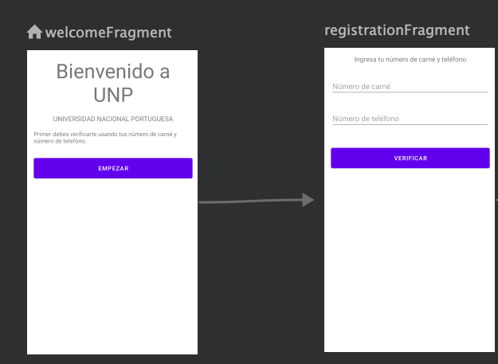

## Agregar fragmentos al Navigation Graph

1. Abrir `navigation.xml`, en el editor de navegación, clic en `New destination`. Una lista de fragmentos y actividades aparece.

2. Seleccionamos **WelcomeFragment** primeramente.

> NOTA: Si en la vista previa aparece un mensaje "Preview Unavailable", vamos al codigo de `navigation.xml` y nos aseguramos que en nuestro framento tenga la propiedad `tools:layout="@layout/welcome_first"`.

3. De la misma forma agregamos **RegistrationFragment** y **VerifyFragment**.

4. Seleccionamos el `WelcomeFragment`, aparecera un circulo al lado derecho y arrastramos hacia `RegistrationFragment`.

5. Seleccionamos la flecha que se agrego entre los dos fragments y observamos el panel de atributos, el `ID` de la accion debe aparecer como `action_welcomeFragment_to_registrationFragment`.

Al finalizar tendremos el navigation graph de la siguiente forma:



##  Ejecutar navegación

En la clase `WelcomeFragment`, dentro del click listener de botón (start_button), agregamos la siguiente linea indicando que se va a ejecutar la acción:

```kotlin
it.findNavController().navigate(R.id.action_welcomeFragment_to_registrationFragment)
```

En esta parte debemos asegurarnos que tenemos el siguiente `import`:

```kotlin
import androidx.navigation.findNavController
```

## Agregar un botón "Atrás"

El **App Bar** también llamada **Action Bar**, es un espacio en el que podemos agregar algunas opciones de navegación, en este caso vamos a agregar un botón de navegación hacia atrás.

El botón por defecto tiene un ícono de una flecha `<--`, este botón solo navega dentro de la app. Nunca se usaria para sacar al usuario del app.

1. Abrimos la clase `MainActivity`. Dentro de la función `onCreate()`, agregamos el siguiente codigo para encontrar el objeto Navigation Controller:

```kt
val navController = this.findNavController(R.id.mainNavHostFragment)
```

2. También dentro de la función `onCreate()`, enlazamos el Navigation Controller con el App Bar:

```kt
NavigationUI.setupActionBarWithNavController(this, navController)
```

3. Después de la función `onCreate()`, sobreescribimos la función `onSupportNavigateUp()` para llamar la función `navigateUp()` del navigation controller:

```kt
override fun onSupportNavigateUp(): Boolean {
    val navController = this.findNavController(R.id.mainNavHostFragment);
    return navController.navigateUp()
}
```

4. Ejecutamos la app y veremos en la barra superior aparace el botón atrás a la izquierda.

## Ejercicio Práctico

1. En `RegistrationFragment` agregar un action hacia `VerifyFragment` y mandar a ejecutar la navegación.

2. En `RegistrationFragment` agregar un botón "Cancelar" y al presionarlo debe regresar a `WelcomeFragment`.
