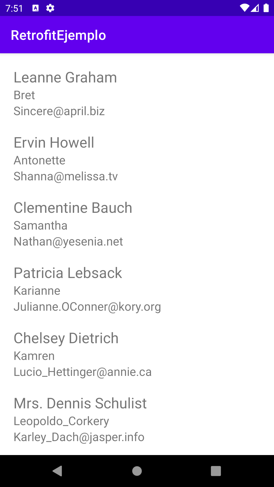

# Examen segundo parcial

1. Descargar proyecto inicial en el **siguiente [Enlace](./assets/RetrofitEjemplo_Exam.zip)**.

2. En el archivo `ApiService.kt` tenemos la configuración necesaria para interactuar con el API de pruebas de [JSON Placeholder](https://jsonplaceholder.typicode.com/) y a través del método `getUsers()` podemos obtener una lista de usuarios (Clase User).

3. En la clase `MainActivity` se hace un llamado al método `getUsers()` obteniendo la lista de **Usuarios**, se requiere agregar la configuración necesaria para mostrar los datos del usuario (name, username, email) haciendo uso de un `RecyclerView`.

4. Agregar `ViewHolder` y `Adapter` necesarios en los archivos que ya han sido creados en el proyecto.

5. El layout que se debe usar con el RecyclerView es el archivo `user_item_row.xml`.

### Resultado final

### Entrega

* Enviar proyecto comprimido en `ZIP` (No enviar RAR).
* Valor `20pts`.
* Fecha de entrega: Viernes 13, Mayo.
