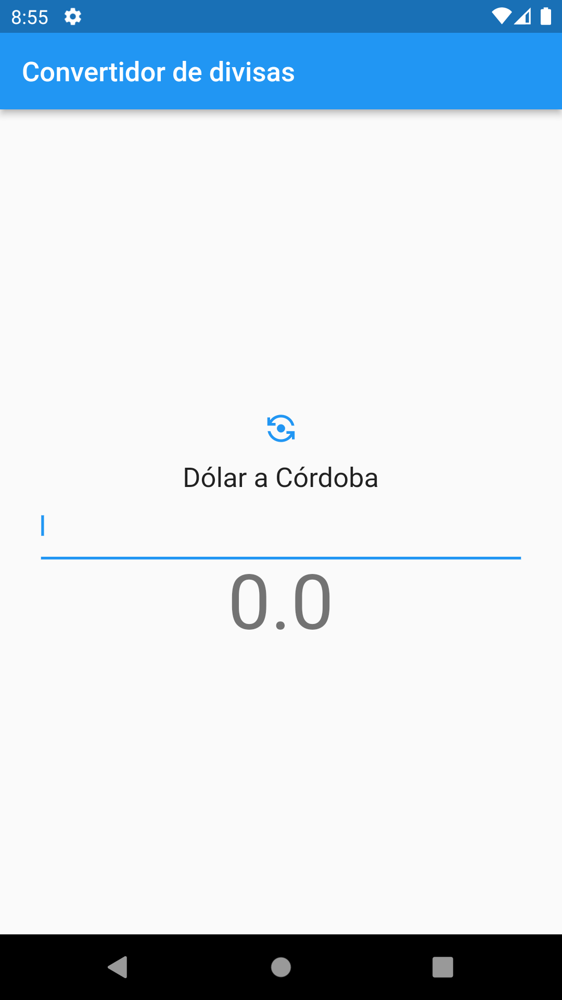

## Acerca del proyecto

* Descargar el proyecto en el siguiente [ENLACE](./assets/convertidor_divisas.zip).

  * El proyecto consiste en un Convertidor de Divisas (Dólar a Córdobas y viceversa).

  * Al ingresar una cantidad en el cuadro de texto se debe hacer el cálculo para mostrar al usuario.

  * Al presionar el botón superior se cambia entre Dólar/Córdoba y Córdoba/Dólar.

  * La tasa de cambio ya está definida dentro del Widget.

<!--  -->

## Indicaciones

* Investigar sobre `Stateful Widgets en Flutter`.

* Completar en el código fuente el cálculo necesario para mostrar al usuario el resultado de la conversión ya sea Dólar/Córdoba y Córdoba/Dólar.

* Se deben mostrar solamente 2 decimales.

* Si la caja de texto está vacia se debe mostrar cero (0).

## Entrega

* Domingo 8 de Marzo.

* Enviar por correo un archivo o enlace de descarga comprimido en ZIP (no RAR).

* Valor 20pts
