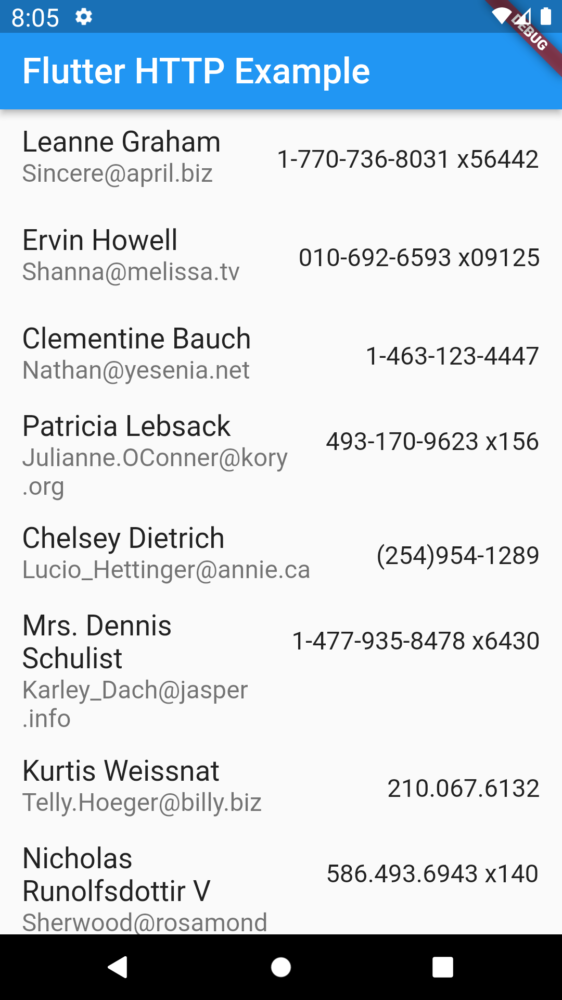

## Contenido

1. Agregar el paquete `http`.
2. Crear una clase `User`.
3. Hacer una petición http de tipo `GET`.
4. Convertir los datos en JSON a una lista de tipo `User`.
5. Mostrar los datos obtenidos en un `ListView`.

## Programación Asíncrona

### Futures

`Future` es una clase que representa el resultado de una operación asíncrona y puede tener 2 estados: incompleta o completada.

Cuando llamamos una función asíncrona, nos retorna un estado `INCOMPLETO`, mientras tanto espera a que la función asíncrona finalice o lance algun error.

Si la operación asíncrona es satisfactoria, entonces se completa con un valor, sino se completa con un error.

### Async y Await

La palabras reservadas `async` y `await` sirven para definir una función asíncrona y para esperar su resultado.

Uso de async:

```dart
Future<int> calcularDistanciaAlSol() async {
  // calcular distancia al sol
  return 100;
}
```

Uso de await:

```dart
var distancia = await calcularDistanciaAlSol();
```

## Agregar paquete http

El paquete `http` provee una forma muy simple para obtener información de internet. Para instalarlo, lo agregamos en la sección de dependencias en el archivo `pubspec.yaml`.

> En este caso estamos usando la última versión 0.13.4

```yaml
dependencies:
  http: ^0.13.4
```

Para hacer uso de este paquete hacemos un `import` en donde sea que lo vayamos a ejecutar.

```dart
import 'package:http/http.dart' as http;
```

## Crear clase User

Crear un archivo llamado `user.dart` y agregar la siguiente clase:

```dart
class User {
  final int id;
  final String name;
  final String username;
  final String email;
  final String phone;

  const User({
    required this.id,
    required this.name,
    required this.username,
    required this.email,
    required this.phone,
  });

  factory User.fromJson(Map<String, dynamic> json) {
    return User(
      id: json['id'],
      name: json['name'],
      username: json['username'],
      email: json['email'],
      phone: json['phone'],
    );
  }
}
```

El constructor `User.fromJson(Map<String, dynamic> json)` nos servirá para crear un instancia de `User` a partir de los datos que vienen de la respuesta del API en formato JSON.

## Lista de usuarios

* Creamos un archivo llamado `users_list_widget.dart`.

* Agregamos el siguiente widget, que contiene un `ListView` y recibe una lista de usuarios para mostrar.

```dart

class UsersList extends StatelessWidget {
  const UsersList({ Key? key, required this.usuarios });

  final List<User> usuarios;

  @override
  Widget build(BuildContext context) {
    return ListView.builder(
      itemCount: usuarios.length,
      itemBuilder: (context, index) {
        return ListTile(
          title:  Text(usuarios[index].name),
          subtitle: Text(usuarios[index].email),
          trailing: Text(usuarios[index].phone),
        );
      },
    );
  }
}
```

## Hacer una petición http

* En este ejercicio vamos a realizar una petición de tipo GET al endpoint [https://jsonplaceholder.typicode.com/users](https://jsonplaceholder.typicode.com/users)

* Se crea un método asíncrono llamado `obtenerUsuarios()` que nos regresa un `Future` de tipo `List<User>`.

* Este método se agrega en nuestro Widget principal.

```dart
Future<List<User>> obtenerUsuarios() async {
  final response = await http.get(Uri.parse("https://jsonplaceholder.typicode.com/users"));

  // validar código de estado
  // 200 es igual a satisfactorio
  if (response.statusCode == 200) {

    // Se convierte la respuesta a un obteno Json
    // Luego el objeto Json se convierte a un Map
    final lista = jsonDecode(response.body).cast<Map<String, dynamic>>();

    // Cada elemento en el Map se convierte en un User
    return lista.map<User>((item) => User.fromJson(item)).toList();

  } else {
    throw Exception('Error al obtener lista de usuarios');
  }
}
```

## Future Builder

* En el widget principal agregamos una variable llamada `usuarios` de tipo `List`.

* Se sobreescribe la función `initState()` que inicializa el estado y mandamos a llamar `obtenerUsuarios()`.

```dart

late Future<List<User>> usuarios;

@override
void initState() {
  super.initState();

  usuarios = obtenerUsuarios();
}
```

* Haciendo uso del widget `FutureBuilder`, que es un widget especialmente diseñado para trabajar con datos de una variable de tipo `Future` validamos si existen datos a través de la propiedad `snapshot`, en caso contrario mostramos una animación que indica que estamos esperando por un resultado.

```dart
FutureBuilder<List<User>>(
    future: usuarios,
    builder: (context, snapshot) {
      if (snapshot.hasData) {
        return UsersList(usuarios: snapshot.data!);
      } else if (snapshot.hasError) {
        return const Center(
          child: Text("Ocurrió un error."),
        );
      }

      return Center(
        child: CircularProgressIndicator(),
      );
    }
),
```

* Nuestro widget principal debería quedar de la siguiente forma:

```dart
class MyHomePage extends StatefulWidget {
  const MyHomePage({Key? key, required this.title}) : super(key: key);

  final String title;

  @override
  State<MyHomePage> createState() => _MyHomePageState();
}

class _MyHomePageState extends State<MyHomePage> {

  late Future<List<User>> usuarios;

  @override
  void initState() {
    super.initState();

    usuarios = obtenerUsuarios();
  }

  Future<List<User>> obtenerUsuarios() async {
    final response = await http.get(Uri.parse("https://jsonplaceholder.typicode.com/users"));

    if (response.statusCode == 200) {
      final lista = jsonDecode(response.body).cast<Map<String, dynamic>>();

      return lista.map<User>((item) => User.fromJson(item)).toList();

    } else {
      throw Exception('Error al obtener lista de usuarios');
    }
  }

  @override
  Widget build(BuildContext context) {

    return Scaffold(
      appBar: AppBar(
        title: Text(widget.title),
      ),
      body: FutureBuilder<List<User>>(
          future: usuarios,
          builder: (context, snapshot) {
            if (snapshot.hasData) {
              return UsersList(usuarios: snapshot.data!);
            } else if (snapshot.hasError) {
              return const Center(
                child: Text("Ocurrió un error."),
              );
            }

            return Center(
              child: CircularProgressIndicator(),
            );
          }
      ),
      // This trailing comma makes auto-formatting nicer for build methods.
    );
  }
}
```

## Resultado final

Al final debemos mostrar la información optenida del API en forma de lista.



## Ejercicio práctico

* Hacer una llamada al endpoint `https://jsonplaceholder.typicode.com/posts` y mostrar los datos obtenidos en un ListView.

* Se deben mostrar las propiedades `title` y `body`.

* Se debe crear una clase llamada `Post` que contenga los datos del Json obtenido.

* Valor `5pts`
