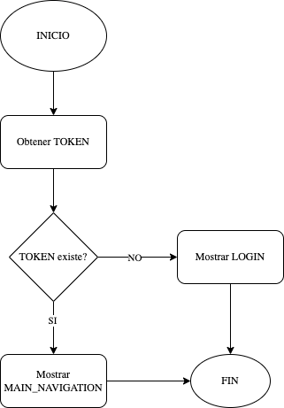

## Intro

En esta sección vamos a desarrollar una aplicación con Flutter que tendrá los siguientes módulos:

1. Inicio de sesión.
2. Lista de cursos (actuales).
3. Historial de cursos (anteriores).
4. Lista de maestros (activos).

Para navegar entre pantallas usaremos un widget `Drawer` (Navigation Drawer en Android).

## Diagrama inicio de sesión

La aplicación deberá mantener la sesión del usuario una vez se haya logueado con sus credenciales correspondiente, se guardará un `TOKEN` de usuario localmente para validar si el usuario ha iniciado sesión. Este flujo esta representado por el siguiente diagrama:



## API

En esta aplicación se obtendrá toda la información desde un API en la siguiente dirección:

URL: [https://shrouded-harbor-95996.herokuapp.com](https://shrouded-harbor-95996.herokuapp.com)

A continuación se detallan los endpoints:

| Endpoit | Descripción     |
| :------------- | :------------- |
| POST `/auth/login`     | Login de usuario. Recibe 2 valores (username, password)     |
| GET `/auth/user`     | Obtiene información del usuario logueado     |
| GET `/courses`     | Lista de cursos actuales      |
| GET `/courses/:id`     | Detalle de un curso (se filtra por id)      |
| GET `/courses/history`     | Historial de cursos      |
| GET `/teachers`     | Lista de maestros      |

## Iniciar proyecto

1. Crear un proyecto en blanco de Flutter.

2. Agregar las siguientes dependencias en el archivo `pubspec`:

```yaml
dependencies:
  http: ^0.13.4
  shared_preferences: ^2.0.15
```

> `SharedPreferences` es un Plugin que nos permite manejar una base de datos local de tipo llave/valor (equivalente a SharedPreferences en Android y UserDefaults en iOS). Este plugin no se debe usar para guardar datos sensibles de nuestra aplicación pero en el caso de este ejemplo es aceptable.

3. Crear los siguientes directorios dentro de `/lib`:
    * ui
    * ui/screens
    * ui/widgets
    * models
    * services

4. Crear los siguientes archivos dentro de `ui/screens`:
    * login_screen.dart
    * main_navigation_screen.dart
    * courses_screen.dart
    * history_screen.dart
    * teachers_screen.dart

5. Crear un archivo llamado `auth_service.dart` en `/services`.

6. Crear un archivo llamado `login_response.dart` en `/models`.

## Crear modelo LoginResponse

1. Cuando consultamos nuestra API para iniciar sesión obtenemos la siguiente respuesta JSON (con 3 campos):

```json
{
	"id": "21D2ACF2-282B-4D3B-41E1-5B64825A0F5C",
	"token": "D78BE8E5-C2EC-3E41-E648-44F237897B55eyJhbGciOiJIUzI1NiIsInR5cCI6IkpXVCJ9.eyJzdWIiOiIxMjM0NTY3ODkwIiwibmFtZSI6IkpvaG4gRG9lIiwiaWF0IjoxNTE2MjM5MDIyfQ.SflKxwRJSMeKKF2QT4fwpMeJf36POk6yJV_adQssw5c",
	"isAdmin": true
}
```

2. Haciendo uso de la herramienta [Quicktype](https://app.quicktype.io/) vamos a generar una clase en Dart a partir del JSON obtenido. Nos dirigimos al sitio y pegamos el JSON, luego seleccionamos Dart como lenguaje, le asignamos un nombre como `LoginResponse` y copiamos el código generado en nuestro proyecto en el archivo `models/login_response.dart`.

## Crear servicio AuthService

1. En el archivo `services/auth_service.dart` creamos una clase llamada AuthService y agregamos una constante de tipo `String` llamada url.

```dart
class AuthService {

  static const String url = 'https://shrouded-harbor-95996.herokuapp.com';

}
```

2. Luego agregamos una función llamada `getToken()` que nos servirá para consultar si hay un **token de usuario** almacenado en la aplicación, en el caso que no haya un **token**, el valor será nulo.

```dart
static Future<String?> getToken() async {
  final pref = await SharedPreferences.getInstance();
  final token = pref.getString("user_token");

  return token;
}
```

3. Luego agregamos una función llamada `login(...)` que recibe 2 parámetros y se encarga de consultar el API para autenticar el usuario. Nos retorna un valor `Future` de tipo `LoginResponse`:

```dart
static Future<LoginResponse> login(String username, String password) async {
  final response = await http.post(
    Uri.parse(url + '/auth/login'),
    headers: <String, String>{
      'Content-Type': 'application/json; charset=UTF-8',
    },
    body: jsonEncode(<String, String>{
      'username': username,
      'password': password,
    }),
  );

  if (response.statusCode == 200) {
    final body = jsonDecode(response.body);
    final data = LoginResponse.fromJson(body);

    final pref = await SharedPreferences.getInstance();
    await pref.setString("user_token", data.token);

    return data;
  } else {
    throw Exception('Error al iniciar sesión. Su usuario o contraseña son incorrectos.');
  }
}
```

4. Se agregan los `imports` que sean necesarios.

```dart
import '../models/login_response.dart';
import 'package:http/http.dart' as http;
import 'package:shared_preferences/shared_preferences.dart';
import 'dart:convert';
```

## Asignación 1

* Agregar en AuthService una función para llamar al endpoint `/auth/user`.

* Agregar una clase llamada CoursesService y agregar funciones para llamar los endpoints relacionados a los cursos.

* Agregar una clase llamada TeachersService y agregar funciones para llamar los endpoints relacionados a los maestros.

* Leer sobre el widget `Drawer`.

> Recuerde crear los archivos y modelos necesarios.
