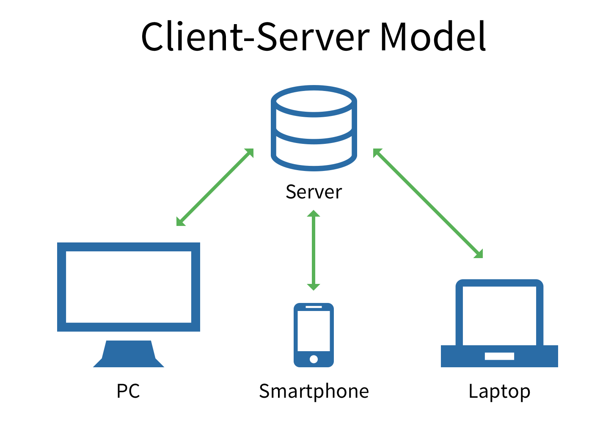

# Introducción

## Contenido del curso

| Semana | Tema     |
| :------------- | :------------- |
| 1       | Introducción al desarrollo web.       |
| 2       | HTML: Estructura y etiquetas.       |
| 3       | CSS: Introducción, sintaxis y selectores.       |
| 4       | Estructuras y decoración en CSS .      |
| 5       | Responsive Design + **Evaluación Primer Parcial**       |
| 6       | Introducción a JavaScript.       |
| 7       | Variables, objetos, funciones, condicionales y otras caracteristicas de JavaScript.       |
| 8       | Manipulación del DOM       |
| 9       | Single Page Applications (SPA)       |
| 10       | Progressive Web Applications (PWA) + **Evaluación Segundo Parcial**       |


## ¿Qué es la web?

Es un sistema a través del cual se gestiona información que se puede transmitir a través del protocolo HTTP (HyperText Transfer Protocol). Para su creación se emplea el lenguaje HTML (HyperText Markup Langue) que permite crear documentos que se comparten a través de internet.

La web se desarrollo por el inglés **Tim Berners-Lee** mientras trabajaba en el **CERN** en Ginebra, Suiza. Por ello es considerado el padre de la World Wide Web y él estableció la primera comunicación entre un cliente y un servidor usando el protocolo **HTTP**.

**Tim Berners-Lee** también fundó el Consorcio de la World Wide Web conocido también como **W3C** con seden en el **MIT** (Instituto de Tecnología de Massachusetts) para supervisar y estandarizar el desarrollo de las tecnologías sobre las que se fundamenta la web y que permiten el funcionamiento de Internet.

## Modelo cliente-servidor

Es una arquitectura que consiste basicamente en un cliente que realiza peticiones a un programa (Servidor: proveedor de recursos) el cual da una respuesta.



Algunos ejemplos de aplicaciones que usen el modelo cliente-servidor son:

* El correo electrónico.
* Servidor de impresión.
* World Wide Web.

## Navegadores

* Un **navegador web** es un software, aplicación o programa que permite el acceso a la Web, interpretando la información de distintos tipos de archivos y sitios web para que puedan ser vistos.

* Un navegador web nos permite la visualizacion de documentos de texto, con recursos multimedia incrustrados, visitar páginas web y realizar acciones en ella, como enlazar un sitio con otro, imprimir, enviar y recibir correos, entre otras.

* Los documentos que se muestran en un navegador pueden estar ubicados en la computadora de forma local o en cualquier otro dispositivo conectado en la computadora del usuario o a través de Internet y que tengas los recursos necesarios para la transmisión de los documentos.

Los navegades más utilizados en la actualidad son:

* Google Chrome
* Microsoft Edge
* Safari (Apple)
* Firefox (Mozilla foundation)
* Internet Explorer (será descontinuado a partir de junio 2022)
* Opera
* **Brave** (basado en Chromium, bloquea anuncios, facilita la seguridad, mayor rapidez) 👍

## Editores de código

Es un programa informático diseñador especificamente para editar código fuente de programas informáticos. Los editores de código tienen caracteristas diseñadas exclusivamente para simplificar y acelerar la escritura del código, por ejemplo:

* Resaltado de sintaxis.
* Autocompletado.
* Cierre de llaves

Entre los editores de código que podemos utilizar en el transcurso de la clase están:

* [Atom](https://atom.io/)
* [Visual Studio Code (VSCode)](https://code.visualstudio.com/)
* [Sublime Text](https://www.sublimetext.com/)
* [Brackets](https://brackets.io/)

> **NOTA:** También podemos usar editores de código en linea como [JSFiddle](https://jsfiddle.net/) para hacer pruebas rápidas o de concepto.

## HTML

HTML (Lenguaje de Marcas de Hipertexto, del inglés HyperText Markup Language) es el componente más básico de la Web. Define el significado y la estructura del contenido web. Además de HTML, generalmente se utilizan otras tecnologías para describir la apariencia/presentación de una página web (CSS) o la funcionalidad/comportamiento (JavaScript).

"Hipertexto" hace referencia a los enlaces que conectan páginas web entre sí, ya sea dentro de un único sitio web o entre sitios web. Los enlaces son un aspecto fundamental de la Web. Al subir contenido a Internet y vincularlo a las páginas creadas por otras personas, te conviertes en un participante activo en la «World Wide Web».

> **Otra definición podría ser:** HTML no es un lenguaje de programación; es un lenguaje de marcado que define la estructura de tu contenido. HTML consiste en una serie de elementos que usarás para encerrar diferentes partes del contenido para que se vean o comporten de una determinada manera.

### Elemento HTML

Las partes principales del elemento son:

1. `La etiqueta de apertura`: consiste en el nombre del elemento, encerrado por paréntesis angulares (< >) de apertura y cierre. Establece dónde comienza o empieza a tener efecto el elemento.

2. `La etiqueta de cierre`: es igual que la etiqueta de apertura, excepto que incluye una barra de cierre (/) antes del nombre de la etiqueta. Establece dónde termina el elemento.

3. `El contenido`: este es el contenido del elemento.

<iframe width="100%" height="300" src="//jsfiddle.net/rx__danny/bpz2qkdr/2/embedded/html,result/" allowfullscreen="allowfullscreen" allowpaymentrequest frameborder="0"></iframe>

### Atributos

Los elementos HTML tambien pueden tener atributos, estos contienen información adicional del elemento, la cual no se refleja en el contenido real del elemento.

En el ejemplo siguiente `class` es el nombre del atributo y `content` el valor del atributo. En este caso el atributo `class` permite darle al elemento un nombre identificativo, que se puede utilizar luego para agregarle información de estilos o dinamismo.

```html
<p class="content">HTML no es un lenguaje de programación</p>
```

### Anidación

Podemos también colocar elementos dentro de otros elementos, esto se llama anidamiento. Por ejemplo, para resaltar una palabra del texto, podemos encerrarla en un elemento `<strong>`, que significa que dicha palabra se debe enfatizar:

<iframe width="100%" height="300" src="//jsfiddle.net/rx__danny/jrta1vce/embedded/html,result/" allowfullscreen="allowfullscreen" allowpaymentrequest frameborder="0"></iframe>

### Elementos vacíos

Algunos elementos no poseen contenido, y son llamados elementos vacíos. Por ejemplo, el elemento ``:

```html
<!-- No tiene etiqueta de cierre -->

```

### Anatomía de un documento HTML

Varios elementos HTML se combinan para formar una página HTML (un archivo con extension `.html`). Generalmente usamos un archivo llamado `index.html` como punto de partida y podemos agregar cuantos archivos `.html` necesitamos y vincularlos entre sí.

```html
<!DOCTYPE html>
<html>
  <head>
    <meta charset="utf-8">
    <title>Página de prueba</title>
  </head>
  <body>
    
  </body>
</html>
```

* `<!DOCTYPE html>`: En los inicios de HTML se utilizaba para definir ciertas reglas que se debian cumplir para que la página fuese considerada buena o se realizaran verificaciones de errores automaticamente. Hoy en dia es irrelevante pero siempre se agrega al inicio siempre.

* `<html></html>`: Este elemento encierra todo el contenido de la página entera y, a veces, se le conoce como el elemento raíz.

* `<head></head>`: Este elemento actúa como un contenedor de todo aquello que quieres incluir en la página HTML que no es contenido visible por los visitantes de la página. Incluye cosas como palabras clave (keywords), una descripción de la página que quieres que aparezca en resultados de búsquedas, código CSS para dar estilo al contenido, etc.

* `<meta charset="utf-8">`: Este elemento establece el juego de caracteres que tu documento usará en **utf-8**, que incluye casi todos los caracteres de todos los idiomas humanos. Básicamente, puede manejar cualquier contenido de texto que puedas incluir. No hay razón para no establecerlo y puede evitar problemas en el futuro.

* `<title></title>`: establece el título de tu página, que es el título que aparece en la pestaña o en la barra de título del navegador cuando la página es cargada, y se usa para describir la página cuando es añadida a los marcadores o como favorita.

* `<body></body`: Encierra todo el contenido que deseas mostrar a los usuarios web que visiten tu página, ya sea texto, imágenes, videos, juegos y demás.

## CSS

Mientras que HTML se utiliza para definir la estructura y la semántica del contenido, CSS se usa para darle estilo y posicionarlo visualmente. CSS (Cascading Stylesheets) se puede usar, por ejemplo, para cambiar la fuente, el color, el tamaño y el espaciado del contenido, para formar multiples columnas, añadir animaciones y otros elementos decorativos.

### Agregar CSS a un documento

Lo primero que se debe hacer es decirle al documento HTML que hay algunas reglas CSS que queremos que use.

1. Creamos un archivo en la misma carpeta del documento HTLM y lo guardamos como `styles.css`.

2. Para vincular styles.css a un archivo **HTML**, se añade la siguiente línea en algún lugar dentro del `<head>` del documento:

```html
<link rel="stylesheet" href="styles.css">
```

Este elemento `<link>` le dice al navegador que hay una hoja de estilo con el atributo `rel` y la ubicación de esa hoja de estilo como el valor del atributo `href`.

### Dar formato a elementos HTML

Hacemos esto con un `selector de elementos`: un selector que coincide directamente con el nombre de un elemento **HTML**. Para determinar todos los párrafos del documento, se usa el selector `p`. Para hacer que todos los párrafos se vean rojos se usa:

```css
p {
  color: red;
}
```

### Múltiples selectores

Podemos determinar múltiples selectores a la vez, separándolos con una coma. Si queremos que todos los párrafos `p` y todos los títulos `h1` de la lista sean rojos, el código se verá así:

```css
p, h1 {
    color: red;
}
```

#### 💡 Ejemplo HTML + CSS

---

<iframe width="100%" height="300" src="//jsfiddle.net/rx__danny/r9q5bj1c/5/embedded/html,css,result/" allowfullscreen="allowfullscreen" allowpaymentrequest frameborder="0"></iframe>

## Responsive design

En los primeros días del diseño web, las páginas se diseñaban para llenar un tamaño de pantalla en particular. Si el usuario tenía una pantalla más grande o más pequeña, los resultados esperados iban desde barras de desplazamiento no deseadas hasta longitudes de línea excesivamente largas y un mal uso del espacio. A medida que estuvieron disponibles tamaños de pantalla más diversos, apareció el concepto de diseño web responsivo (RWD, responsive web design), un conjunto de prácticas que permite a las páginas web alterar su diseño y apariencia para adaptarse a diferentes anchos de pantalla, resoluciones, etc. Es una idea que cambió la forma en que diseñamos para una web multidispositivo.

### Media queries

Es el elemento fundamental del diseño responsivo y nos permiten ejecutar una serie de pruebas (por ejemplo, si la pantalla del usuario es mayor que un ancho o una resolución determinados) y aplicar CSS selectivamente para diseñar la página de manera que resulte adecuada a las necesidades del usuario.

Por ejemplo, la siguiente **media query** cambia el color de fondo del elemento `<body>` a negro (black) cuando la ventana del navegador es `600px` o menos:

```css
@media only screen and (max-width: 600px) {
  body {
    background-color: black;
  }
}
```
