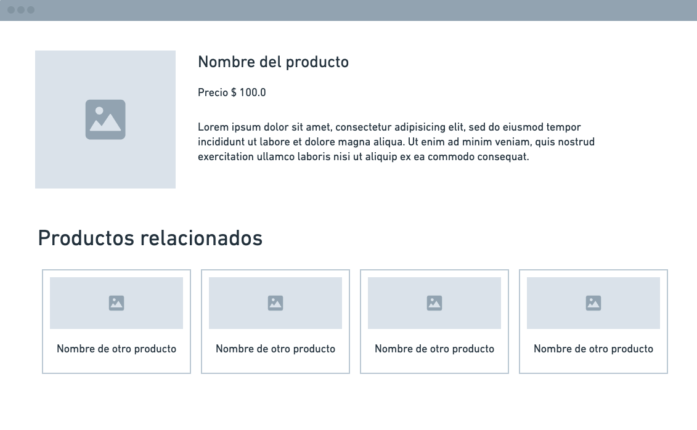

# Responsive design

**Responsive web design** es una metodología o técnica para crear páginas web que se vean bien en todos los dispositivos. Un diseño **responsivo** se ajusta automaticamente al tamaño de una pantalla o **viewport**.

Para hacer un diseño responsivo usamos **HTML** y **CSS** para redimensionar, ocultar, encoger o alargar los elementos de una página y que se vea bien en todos los dispositivos (desktop, tablets y teléfonos).

## ¿Qué es el Viewport?

Basicamente es el área visible de una página web. El **viewport** varía por dispositivo, puede ser pequeño en un teléfono o más grande en una pantalla de ordenador.

## Definir el viewport

Para crear un sitio web **responsivo**, agregamos la siguiente etiqueta `<meta>` en todas nuestras páginas:

```html
<meta name="viewport" content="width=device-width, initial-scale=1.0">
```

## Agregar estilos

1. Crear archivos `index.html` y `styles.css`.

2. Crear estructura básica del **HTML** y vincular nuestro archivo **CSS**.

3. En **CSS** vamos a agregar el siguiente estilo de borde y margenes para los elementos `div`:

```css
div {
  border: 1px solid black;
  margin-top: 10px;
  margin-bottom: 10px;
}
```

4. Definimos un estilo para todos los elementos que esten dentro de una clase `row`:

```css
.row * {
  display: inline-block;
  vertical-align: top;
}
```

5. La propiedad `display` especifica el comportamiento al desplegar un elemento.

6. La propiedad `vertical-align` establece el alineamiento vertical del elemento.

7. Agregamos las siguientes clases para manejar nuestro contenido dependiendo de la anchura de los elementos usando porcentajes:

```css
.col-10 {
  width: 9%;
}

.col-20 {
  width: 19%;
}

.col-30 {
  width: 29%;
}

.col-40 {
  width: 39%;
}

.col-50 {
  width: 49%;
}

.col-60 {
  width: 59%;
}

.col-70 {
  width: 69%;
}

.col-80 {
  width: 79%;
}

.col-90 {
  width: 89%;
}

.col-100 {
  width: 99%;
}
```

## Agregar componentes

1. En nuestro archivo **HTML** dentro de la etiqueta `<body>` agregamos los siguientes elementos:

```html
<section class="row">
  <div class="col-10">
    col 10
  </div>
  <div class="col-20">
    col 20
  </div>
  <div class="col-30">
    col 30
  </div>
  <div class="col-40">
    col 40
  </div>
  <div class="col-50">
    col 50
  </div>

  <div class="col-60">
    col 60
  </div>
  <div class="col-70">
    col 70
  </div>
  <div class="col-80">
    col 80
  </div>
  <div class="col-90">
    col 90
  </div>
  <div class="col-100">
    col 100
  </div>
</section>

<section class="row">
  <div class="col-50">
    Lorem ipsum dolor sit amet, consectetur adipisicing elit, sed do eiusmod tempor incididunt ut labore et dolore magna aliqua. Ut enim ad minim veniam, quis nostrud exercitation ullamco laboris nisi ut aliquip ex ea commodo consequat. Duis aute irure dolor in reprehenderit in voluptate velit esse cillum dolore eu fugiat nulla pariatur. Excepteur sint occaecat cupidatat non proident, sunt in culpa qui officia deserunt mollit anim id est laborum.
  </div>
  <div class="col-30">
    Lorem ipsum dolor sit amet, consectetur adipisicing elit, sed do eiusmod tempor incididunt ut labore et dolore magna aliqua. Ut enim ad minim veniam, quis nostrud exercitation ullamco laboris nisi ut aliquip ex ea commodo consequat. Duis aute irure dolor in reprehenderit in voluptate velit esse cillum dolore eu fugiat nulla pariatur. Excepteur sint occaecat cupidatat non proident, sunt in culpa qui officia deserunt mollit anim id est laborum.
  </div>
  <div class="col-20">
    Lorem ipsum dolor sit amet, consectetur adipisicing elit, sed do eiusmod tempor incididunt ut labore et dolore magna aliqua. Ut enim ad minim veniam, quis nostrud exercitation ullamco laboris nisi ut aliquip ex ea commodo consequat. Duis aute irure dolor in reprehenderit in voluptate velit esse cillum dolore eu fugiat nulla pariatur. Excepteur sint occaecat cupidatat non proident, sunt in culpa qui officia deserunt mollit anim id est laborum.
  </div>
</section>

<section class="row">
  <div class="col-40">
    Lorem ipsum dolor sit amet, consectetur adipisicing elit, sed do eiusmod tempor incididunt ut labore et dolore magna aliqua. Ut enim ad minim veniam, quis nostrud exercitation ullamco laboris nisi ut aliquip ex ea commodo consequat. Duis aute irure dolor in reprehenderit in voluptate velit esse cillum dolore eu fugiat nulla pariatur. Excepteur sint occaecat cupidatat non proident, sunt in culpa qui officia deserunt mollit anim id est laborum.
  </div>
  <div class="col-40">
    Lorem ipsum dolor sit amet, consectetur adipisicing elit, sed do eiusmod tempor incididunt ut labore et dolore magna aliqua. Ut enim ad minim veniam, quis nostrud exercitation ullamco laboris nisi ut aliquip ex ea commodo consequat. Duis aute irure dolor in reprehenderit in voluptate velit esse cillum dolore eu fugiat nulla pariatur. Excepteur sint occaecat cupidatat non proident, sunt in culpa qui officia deserunt mollit anim id est laborum.
  </div>
  <div class="col-20">
    Lorem ipsum dolor sit amet, consectetur adipisicing elit, sed do eiusmod tempor incididunt ut labore et dolore magna aliqua. Ut enim ad minim veniam, quis nostrud exercitation ullamco laboris nisi ut aliquip ex ea commodo consequat. Duis aute irure dolor in reprehenderit in voluptate velit esse cillum dolore eu fugiat nulla pariatur. Excepteur sint occaecat cupidatat non proident, sunt in culpa qui officia deserunt mollit anim id est laborum.
  </div>
</section>
```

## Media queries

**Media query** es una técnica introducida en **CSS3**. Usa la regla `@media` para incluir un bloque de CSS cuando se cumple una condición. Por ejemplo:

```css
@media only screen and (max-width: 600px) {
  /* Reglas que se aplicaran cuando la ventana del navegador sea menor o igual a 600px */
}

@media only screen and (min-width: 601px) and (max-width: 800px) {
  /* Reglas que se aplicaran cuando la ventana del navegador tenga un tamaño entre 601px y 800px */
}
```

### Agregar estilos

Agregamos los siguientes media queries para modificar el tamaño de nuestras columnas dependiendo del tamaño:

```css

@media only screen and (max-width: 600px) {
  .col-10,
  .col-20,
  .col-30,
  .col-40,
  .col-50,
  .col-60,
  .col-70,
  .col-80,
  .col-90,
  .col-100 {
    width: 99%
  }
}

@media only screen and (min-width: 601px) and (max-width: 800px) {
  .col-10,
  .col-20,
  .col-30,
  .col-40,
  .col-50 {
    width: 49%
  }

  .col-60,
  .col-70,
  .col-80,
  .col-90,
  .col-100 {
    width: 99%
  }
}

```

## Tarea práctica

* Fecha de entrega: `12 de diciembre`.
* Valor: `15pts`.

### Orientaciones

1. Tomando de referencia la imagen diseñar una página **HTML** con la misma estructura.

2. Agregar estilos con **CSS** según estime conveniente.

3. Agregar **Media queries** para que el diseño se adapte a pantallas más pequeñas.


